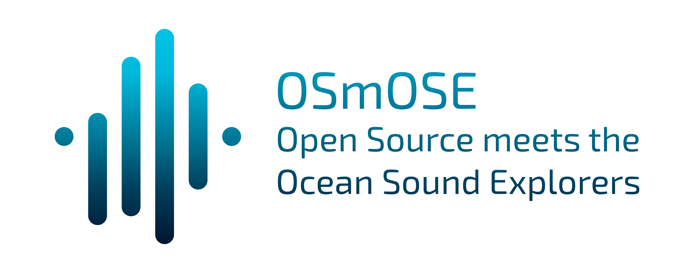

 
 

&nbsp;&nbsp;&nbsp;&nbsp;&nbsp;&nbsp;

 
 

**OSEkit** is an open source suite of tools written in python and dedicated to the management and analysis of data in underwater passive acoustics.

[Presentation](#presentation) •
[Getting into it](#getting-into-it) •
[Acknowledgements](#acknowledgements)
# ㅤ

### Presentation

OSEkit is an open source suite of tools written in python and dedicated to the management and analysis of data in underwater passive acoustics. Among other key features, our toolkit has been adapted to be deployed on a cluster infrastructure; in OSmOSE, our production version runs on [DATARMOR](https://www.ifremer.fr/fr/infrastructures-de-recherche/le-supercalculateur-datarmor). Here are a few indications to help you going through our documentation. 

 

### Getting into it

All details to start using our toolkit and make the most out of it are given in our [documentation](https://project-osmose.github.io/OSEkit/); you will then be redirected to more specific parts of it depending on your profile and intentions:)

 

### Acknowledgements

- A great part of our processing codes are based on well-established python packages for data analysis including scipy ,pandas, numpy...
 
# ㅤ
© OSmOSE team, 2023-present

