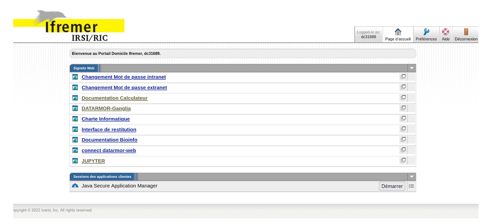

=================
On Datarmor
=================

Installation
=================

Prerequesites
------------------

You need to have an account on Datarmor, that will provide you with 

- extranet logins (username + password) 
- intranet logins (username + password)

Besides, you need to be affiliated to our unix group named gosmose. To get an account, please contact your IT assistant if you are from an institute partner of Datarmor, otherwise please contact `Dorian Cazau <mailto:dorian.cazau@ensta-bretagne.fr>`__ to see how you could join OSmOSE team!

You can now access Datarmor through two different ways, with a command line interface described in :ref:`SSH connexion` or through a jupyter hub session described in :ref:`Jupyterhub`.

.. warning::

   In case of a first connexion, you will have to pass through the :ref:`SSH connexion` first before you can use the jupyterhub of Datarmor. 

SSH connexion
------------------

Getting started
~~~~~~~~~~~~~~~~~~~~~~~~~~~~~~~~~~~~~~

This connexion will require to reach the extranet of Datarmor first, which can be done using a VPN as described in this `document <./extranet_connection.pdf>`__ 

SSH connexion is then straightforward and you should get the screen showed in see :ref:`SSHconnexion_figure_1` with the following command

.. code:: bash
	
	ssh <intranet_username>@datarmor.ifremer.fr 

.. _SSHconnexion_figure_1:

.. figure:: ./figures/SSHconnexion_figure_1.png

	Figure : Console screen after SSH connexion

.. warning::

	In case you happen to be on the intranet network of ENSTA Bretagne, IMT Atlantique or UBO, run instead

	.. code:: bash
		
		ssh <intranet_username>@datarmor

Once you are here you can check your unix group to be sure it is gosmose using the bash command `groups`. Be sure gosmose appears first, a second groups (for your own institution most likely) might be present but must come after gosmose. 

Launch a qsub job
~~~~~~~~~~~~~~~~~~~

.. note::

	We have made a :ref:`tutorial on Conda <Conda>` if you are starting with it

You can now create a job to ask for resources (including internet access) using the `qsub` command, for example

.. code:: bash

	qsub -I -l walltime=1:00:00 -q ftp -S /bin/bash

This job is interactive (parameter -I) and will last for 1 hour (parameter walltime=1:00:00). Interactiveness means standard inputs and outputs (stdin, stdout, stderr) are redirected to your current terminal session and, as a result, you can have direct feedbacks of your job execution. Default memory resources are limited to 500 MB, you may want more resources to install package in conda environment (as we will see in :ref:`Conda environment creation`) ;  to change this use the `mem` parameter:

.. code:: bash

	qsub -I -l walltime=1:00:00,mem=4G -q ftp -S /bin/bash

See section :ref:`Run python codes in qsub jobs` for other configurations of qsub jobs.

Run python codes in interactive qsub jobs
~~~~~~~~~~~~~~~~~~~~~~~~~~~~~~~~~~~~~~~~

Let's start launching an interactive qsub job:

.. code:: bash

	qsub -I -q mpi_1 -l select=1:ncpus=28:mpiprocs=28:mem=120gb -l walltime=01:00:00 -S /bin/bash
	source /appli/hibd/rdma-hadoop-2.x-1.3.5-x86/sbin/quick-hadoop-get-env.sh --conda-env osmose

You can now run python scripts, eg `essai_save_image.py` located in `/home/datawork-osmose/`, as follows

.. code:: bash

	time python3 /home/datawork-osmose/essai_save_image.py

To run your code using a GPU 

.. code:: bash

	qsub -I -q gpuq -l ncpus=10 -l ngpus=1 -l mem=32gb  -l walltime=01:00:00 -S /bin/bash
	
	
	
Run python codes in batch qsub jobs with a PBS file
~~~~~~~~~~~~~~~~~~~~~~~~~~~~~~~~~~~~~~~~

Batch jobs enable to launch a script in background, unlike the interactive mode.
To ease its deployment, you may first want to create a PBS file (written in bash), for example considered a file `job.pbs` defined as follows:

.. code:: bash

	#!/bin/bash
	#PBS -q gpuq
	#PBS -l ncpus=10 -l ngpus=1 -l mem=32gb  -l walltime=01:00:00
	#PBS -S /bin/bash

	# we move to the directory where the PBS file has been called thanks to the special variable PBS_O_WORKDIR
	cd $PBS_O_WORKDIR/
	
	# we load a conda env
	. /appli/anaconda/latest/etc/profile.d/conda.sh 
	conda activate ENV_NAME
	
	# we launch our script, redirecting the output to a file to get feedbacks from its execution
	echo "starting script execution..." &>> log.txt
	python3 /home/datawork-osmose/essai_save_image.py &>> log.txt

You can now simply run this code by entering the following line in the terminal:

.. code:: bash

	qsub job.pbs

Your code is now running. To monitor its execution, consider reading the log file (`log.txt` in the example). To learn about its general state, consider the following command:

.. code:: bash

	qstat -u intranet_username

The results show your current jobs as well as their status (Q means queued, H held, R running, E exiting. Please refer to the qstat manual for more information).

Jupyterhub
------------

Getting started
~~~~~~~~~~~~~~~~~~~~~~~~~~~~~~~~~~~~~~

The jupyterhub of Datarmor is directly reachable via this `portal <https://domicile.ifremer.fr/dana-na/auth/url_default/welcome.cgi>`__. Once you are on the Portail Domicile Ifremer (see :ref:`Jupyterhub_figure_1`) after entering your extranet logins, click on JUPYTER, enter your intranet logins when asked and click on Start My Server. 

.. _Jupyterhub_figure_1:

	
	Figure : Portail Domicile Ifremer

You will then have to select a job profile, which will allocate to your jupyterhub session different amount of computer resources. By default, we recommend to use Datarmor - Jupyterlab - 8 cores, 32 GB RAM, 2 hours (quite equivalent to a personal computer). 

You are now on the Jupyter-Hub of Datarmor!

.. warning::

	Finally : some things to check and keep in mind

	-  Do not use the jupyterhub session to download or upload high volume data, only a few small files
	-  Be aware of your computational resources, and avoid overusing them (this will crash your kernel) ! Conversely, avoid underusing your notebook, especially do not forget to close your notebook session once you are done (see Step 3)
        -  Often check that you do not have several jupyterhub sessions running simultaneously (use qstat and qdel, please refer to the Glossary)

In case of connection problems, please report it to Dorian Cazau and contact the `assistance <mailto:assistance@ifremer.fr>`__ at IFREMER. 

Use the toolkit through notebooks
~~~~~~~~~~~~~~~~~~~~~~~~~~~~~~~~~~~~~~

Our toolkit has been made accessible through user-friendly notebooks covering different basic use cases (eg build a OSmOSE dataset) and more advanced applications (eg workflow for weather estimation), which have been presented in this documentation in :ref:`Basic use cases` and :ref:`Advanced use cases`. These notebooks are also present on in our Datarmor workspace at `/home/datawork-osmose/osmose-datarmor/notebooks/`. You will have to make a copy of them into your personal workspace. To do this, open a terminal from your jupyterhub portal and run the following command:

.. code:: bash

	cp -R /home/datawork-osmose/osmose-datarmor/notebooks/ ./osmose_notebooks/ ; chmod 700 -R ./osmose_notebooks/

To open a notebook, just double click on it. If your notebook kernel is different from osmose, change it in Kernel -> Change Kernel -> Python [conda env:osmose]. This is the latest stable version. 

Shut down your jupyterhub session
~~~~~~~~~~~~~~~~~~~~~~~~~~~~~~~~~~~~~~~~~~~~~~~~~~~~~~~

Once you are done with your work, please follow this procedure to close your session : on the Jupyter Hub main page -> click tab Running -> click on all Shutdown then click on the button Logout on the Jupyter Hub main page.

Conda environment creation 
===========================

Below are listed the steps to create and build a conda environment that will be available in your Jupyter Hub sessions Note that there is possibly a delay between the creation and disposal of your environment.

Pre-requirements
------------------------

Please first connect to Datarmor via :ref:`SSH connexion`. Once you are in your datahome, check that your `~/.condarc` file contains the following elements (run `cat .condarc`)

.. code:: bash

	envs_dirs:
	  - /home/datawork-osmose/conda-env
	  - /home3/datahome/dcazau/conda-env
	  - /appli/conda-env
	  - /appli/conda-env/2.7
	  - /appli/conda-env/3.6

If different, edit this file to insert those elements.

Procedure for conda environment creation / modification
------------------------------------------------------------

.. note::

	We have made a :ref:`tutorial on Conda <Conda>` if you are starting with it

1. Launch an interactive qsub job following the procedure described in :ref:`Launch a qsub job`. Be careful of the memory asked, package installation might need memory higher than the default 500 MB

2. Activate conda commands in a bash shell

.. code:: bash
	bash
	. /appli/anaconda/latest/etc/profile.d/conda.sh

3. Create your ENV_NAME conda environment, for example here in the version python 3.10 

.. code:: bash

	conda create --name ENV_NAME python=3.10

.. note::

	By default on Datarmor, this command will create an environment in your local home directory (of the form `/home3/datahome/dcazau/conda-env`), making it only usable by yourself. In case you would like a conda environment usable by the OSmOSE group, you will have to change your environment location by setting the parameter `-p`

	.. code:: bash

		conda create --p /home/datawork-osmose/conda-env/ENV_NAME python=3.10 

Note that this is mandatory in case you want to use your conda environment within pbs jobs, through the argument `env_name` of method `jb.build_job_file`. If you had already installed a conda environment in your datahome and you want to use it in the `datawork-osmose`, you can use the `clone` command as follows (for example here for the environment `osmose_stable_test`)

	.. code:: bash
		conda create --prefix=/home/datawork-osmose/conda-env/osmose_stable_test --clone /home3/datawork/dcazau/conda-env/osmose_stable_test

.. warning::

	Reported bug : changing python version will need to set the environment path with `-p`, otherwise it will be installed in `/dcazau/$Datarmor/...` 

4. Verify that your conda environment is present in the `conda-env` folder (in your datahome or your datawork directory) ; running the command `conda info --envs` should give you for example

.. code:: bash

	                      /home/datawork-osmose/conda-env/mmdetect
	                      /home/datawork-osmose/conda-env/osmose
	osmose_dev_dcazau    /home3/datawork/dcazau/conda-env/osmose_dev_dcazau

.. warning::
	
	Note that your new environment should also be present in ` .conda/environments.txt` ; if not add it manually in this file, making sure to end the **environment path without a `/`**

5. After activation of your environment, install the package `ipykernel` to be able to see your environment in the kernes available in jupyterhub

.. code:: bash

	conda install ipykernel

6. In case you created an environment in the `datawork-osmose`, do not forget to change its permissions so it can be read and executed by any member of OSmOSE

.. code:: bash

	chmod 700 -R /home/datawork-osmose/conda-env/ENV_NAME

Develop and contribute using github and poetry
===============================================

Although Datarmor should not be used as a development environment, step 4 from our github-based contribution workflow described in :ref:`Contribute` may include a few specific developments regarding features only available on Datarmor (typically everything related to distributed computing). The installation procedure described in :ref:`Installation with github and poetry` is still valid, just considered your Datarmor datahome as your local working directory ; just be cautious with the Conda environment creation on Datarmor, better you read :ref:`Procedure for conda environment creation / modification` if it is your first time.

