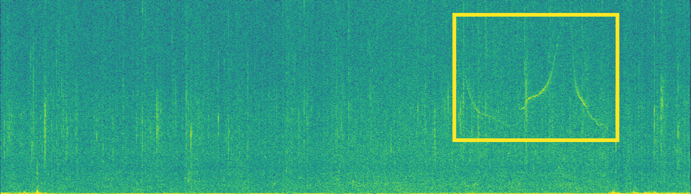
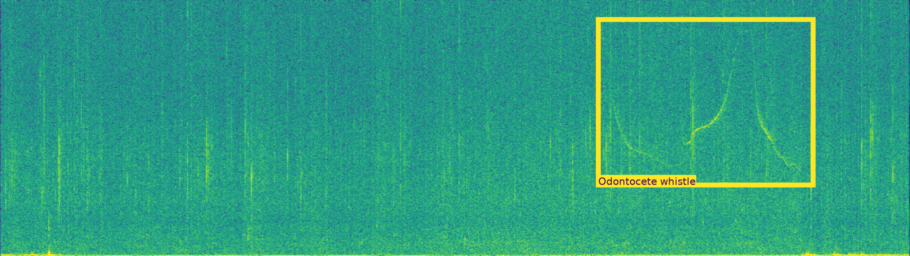
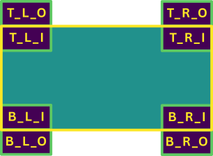

.. _aplose:

Working with APLOSE results
---------------------------

`APLOSE <https://osmose.ifremer.fr/app//>`_ is **OSmOSE**'s web-based annotation platform.

**APLOSE** campaigns `results <https://project-osmose.github.io/APLOSE/user/annotation-campaign/phase-progress-result/>`_ are provided as csv files
that can be parsed in **OSEkit** as :class:`osekit.core.detection.Detection` instances.

Loading an APLOSE results file
^^^^^^^^^^^^^^^^^^^^^^^^^^^^^^

``Detections`` can be extracted from **APLOSE** results files thanks to the :meth:`osekit.core.detection.Detection.from_csv` method:

.. code-block:: python

    from pathlib import Path
    from osekit.core.detection import Detection

    detections = Detection.from_csv(csv=Path(r"_static/detections/aplose_results.csv"))

Detection / Audio interaction
^^^^^^^^^^^^^^^^^^^^^^^^^^^^^

The :class:`osekit.core.detection.Detection` class inherits from the :class:`osekit.core.event.Event` class: detections can easily be used to filter audio and spectro data:

.. code-block:: python

    from osekit.core.spectro_dataset import SpectroDataset

    detection = Detection(...) # Generally Detection.from_csv(...)[i]
    spectro_dataset = SpectroDataset(...)

    # Find all SpectroData in which detection appear:
    positive_spectrograms = SpectroDataset([sd for sd in spectro_dataset.data if sd.overlaps(detection)])

Plotting a detection
^^^^^^^^^^^^^^^^^^^^

Detection boxes can be plotted on spectrograms thanks to the :meth:`osekit.core.detection.Detection.plot` method.

First, let's plot a spectrogram, and keep track of the ``Axes`` in which the spectrogram is plot (returned by the :meth:`osekit.core.spectro_data.SpectroData.plot` method):

.. code-block:: python

    import matplotlib.pyplot as plt
    from osekit.core.spectro_data import SpectroData
    from osekit.core.detection import Detection

    sd = SpectroData(...)
    detection = Detection(...)

    # Plot the spectrogram and keep the Axes in which the plot is made
    ax = sd.plot(ax=ax)

Now, we can plot the detection directly in the ``ax`` Axes.
The detection is plotted as a `matplotlib Rectangle <https://matplotlib.org/stable/api/_as_gen/matplotlib.patches.Rectangle.html>`_.
Keyword arguments can be passed to the rectangle constructor thanks to the ``detection_rect_kwargs`` parameter:

.. code-block:: python

    detection.plot(
        ax=ax,
        detection_rect_kwargs={ # Keyword arguments passed to the Rectangle constructor
            "color": "#fde725",
            "linewidth": 7,
        },
    )

    # Show the spectrogram with the detection plotted on top of it
    plt.show()

Detection labels (:class:`osekit.core.detection.Detection.Label`) can be added to the detection rectangle thanks to the ``plot_label`` parameter.

Labels consist in a background `matplotlib Rectangle <https://matplotlib.org/stable/api/_as_gen/matplotlib.patches.Rectangle.html>`_ and a foreground
`matplotlib Text <https://matplotlib.org/stable/api/text_api.html#matplotlib.text.Text>`_.

Keyword arguments can be passed to the background rectangle thanks to the ``background_kwargs`` parameter and to the foreground text thanks to the
``text_kwargs`` parameter:

.. code-block:: python

    detection.plot(
        ax=ax,
        detection_rect_kwargs={ # Keyword arguments passed to the detection Rectangle constructor
            "color": "#fde725",
            "linewidth": 7,
        },
        plot_label=True,
        label_kwargs={
            "anchor": "bottom_left",
            "inner_text": True,
            "text_kwargs": { # Keyword arguments passed to the label Text
                "color": "#440154",
                "size": "x-large"
            },
            "background_kwargs": {}, # Keyword arguments passed to the label background rectangle
        },
    )

    plt.show()

The label position (relative to the detection rectangle) can be set thanks to the ``anchor`` and ``inner_text`` parameters.

The following figure displays all 8 possible combinations. In the notation ``x_y_z``, ``x_y`` represents the anchor (``T_R`` stands for ``"top_right"``) and ``z`` represents the ``inner_text`` parameter (``I`` for ``True`` (inner), ``O`` for ``False`` (outer)).

