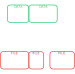

.. _coreapi_introduction:

Introduction
^^^^^^^^^^^^

**OSEkit**'s ``Core API`` provides means of manipulating audio data with **timestamp-based pointers**.
The audio data is decoupled from audio files: audio data can be fetched across multiple files without the user having to worry about it.

The ``Core API`` provides ways of computing and plotting spectrograms, which are also treated as time-bound data that can be joined with
audio (or any other type of) data.

.. _event:

Event
"""""

The :class:`osekit.core_api.event.Event` represent anything that is time-bound: an ``Event`` has a begin and an end, which are described as `pandas Timestamps <https://pandas.pydata.org/docs/reference/api/pandas.Timestamp.html>`_.

Almost every other class in **OSEkit** inherits from ``Event``.

.. _data_files:

Data and Files
""""""""""""""

Decoupling data from files is the cornerstone of **OSEkit**'s behaviour.
Users can define data events from any list of files without worrying of whether the data events scatter across multiple files,
nor if it contains empty time periods between files.

To do so, **OSEkit** uses an intermediary object between the ``Data`` and the ``File``: an ``Item``, which is a **part** of ``Data`` that is found in a **single** ``File``.

As an example, let's consider 3 files that differ in duration (along the x-axis in the figures here below).
The first two files are consecutive, and the third one is separated from the end of the second by a duration for which there is no data.

From these 3 files, the user want to manipulate 2 data objects (for example to plot spectrograms from audio files at these 2 time periods):

Under the hood, **OSEkit** will create intermediate ``Item`` objects that will be used for the data to be fetched seamlessly, with an optimized I/O workflow:

Different type of data
""""""""""""""""""""""

Since **OSEkit** provides ways to manipulate different types of data (audio, spectro, etc.), the `Data` <-> `File` operations described in the :ref:`Data and Files <data_files>` section
are managed in bases classes:

- :class:`osekit.core_api.base_file.BaseFile` represent any **file**
- :class:`osekit.core_api.base_item.BaseItem` represent any **item**
- :class:`osekit.core_api.base_data.BaseData` represent any **data**

These base classes are then derived through inheritance to specialized classes for any data type. For example, **audio data** is manipulated through the
:class:`osekit.core_api.audio_data.AudioData` class.
