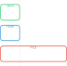
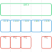
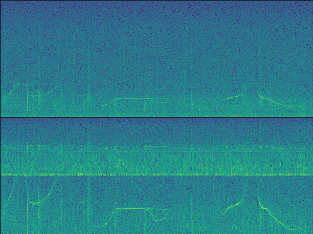
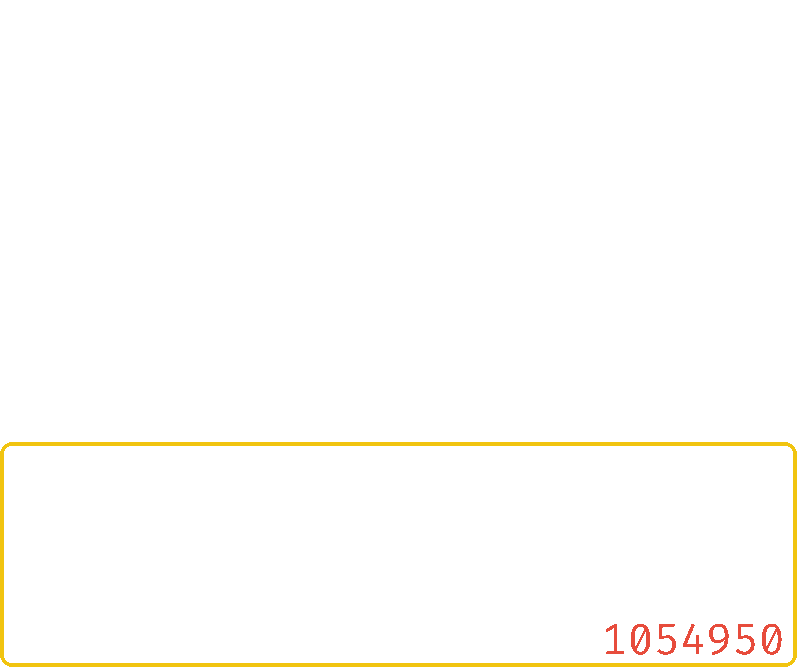

.. _coreapi_usage:

Usage
-----

Audio File
^^^^^^^^^^

To turn an audio file into an **OSEkit** ``AudioFile`` (represented by the :class:`osekit.core_api.audio_file.AudioFile` class), all you need is the path to the file and a begin timestamp.

Such begin timestamp can either be specified (as a :class:`pandas.Timestamp` instance), or parsed from the audio file name by specifing the `strptime format <https://strftime.org/>`_:

.. code-block:: python

    from osekit.core_api.audio_file import AudioFile
    from pathlib import Path

    af = AudioFile(
        path = Path(r"foo/7189.230405154906.wav"),
        strptime_format = "%y%m%d%H%M%S",
        )

Audio Data
^^^^^^^^^^

Design
""""""

The :class:`osekit.core_api.audio_data.AudioData` class represent a chunk of audio taken between two specific timestamps from one or more `AudioFile` instances.

This class offers means of easily resample the data and access it on-demand (with an optimized I/O workflow to minimize the file openings/closings).

To create an ``AudioData`` from ``AudioFiles``, use the :meth:`osekit.core_api.audio_data.AudioData.from_files` class method.

Example for an ``AudioData`` representing the first 2 seconds of the ``foo/7189.230405154906.wav`` audio file:

.. code-block:: python

    from pandas import Timestamp, Timedelta
    from osekit.core_api.audio_data import AudioData

    ad = AudioData.from_files(
    files=[af],
    end=af.begin + Timedelta(seconds=2) # begin and end defaults to the files boundaries: this will take the 2 first seconds of the audio file.
    )

This will lead to the following *data* <-> *file* structure (see the :ref:`Data and Files <data_files>` section):

If the ``AudioData`` begin and end timestamps cover multiple ``AudioFile``, the corresponding ``AudioItem``.

For example, the `foo` folder here below contains 4 ``10 s``-long files, with a ``10 s`` gap between the 3rd and 4th files:

.. code-block::

    foo
    ├── 7189.230405154906.wav
    ├── 7189.230405154916.wav
    ├── 7189.230405154926.wav
    └── 7189.230405154946.wav

Let's create a single ``AudioData`` that covers the total duration of the 4 files:

.. code-block:: python

    afs = [
        AudioFile(f, strptime_format="%y%m%d%H%M%S")
        for f in foo.glob("*.wav")
        ]

    ad = AudioData.from_files(files=afs) # begin and end to default will cover the whole duration of the files

This will create one ``AudioItem`` per file, plus one **empty** ``AudioItem`` for the gap:

We can check that with code:

>>> print("\n".join("\n\t".join((f"Item {idx}", f"{f'Begin':<15}{str(item.begin):>20}", f"{f'End':<15}{str(item.end):>20}", f"{f'Is gap':<15}{"YES" if item.is_empty else "NO":>20}")) for idx,item in enumerate(sorted(ad.items, key=lambda i: i.begin))))
"""
Item 0
	Begin           2023-04-05 15:49:06
	End             2023-04-05 15:49:16
	Is gap                           NO
Item 1
	Begin           2023-04-05 15:49:16
	End             2023-04-05 15:49:26
	Is gap                           NO
Item 2
	Begin           2023-04-05 15:49:26
	End             2023-04-05 15:49:36
	Is gap                           NO
Item 3
	Begin           2023-04-05 15:49:36
	End             2023-04-05 15:49:46
	Is gap                          YES
Item 4
	Begin           2023-04-05 15:49:46
	End             2023-04-05 15:49:56
	Is gap                           NO
"""

Reading data
""""""""""""

The :meth:`osekit.core_api.audio_data.AudioData.get_value` method returns a `numpy.ndarray <https://numpy.org/doc/stable/reference/generated/numpy.ndarray.html>`_ that contains the wav values of the audio data.

The data is fetched seamlessly on-demand from the audio file(s). The opening/closing of the audio files is optimized thanks to a :class:`osekit.core_api.audio_file_manager.AudioFileManager` instance.

Eventual time gap between audio items are filled with ``0.`` values.

Normalization
"""""""""""""

The fetched audio data can be normalized according to the presets given by the :class:`osekit.utils.audio_utils.Normalization` flag:

.. list-table:: Normalization presets
   :widths: 10 10
   :header-rows: 1

   * - Name
     - Description
   * - ``Normalization.RAW``
     - :math:`x`
   * - ``Normalization.DC_REJECT``
     - :math:`x-\overline{ x }`
   * - ``Normalization.PEAK``
     - :math:`\frac{x}{x_\text{max}}`
   * - ``Normalization.ZSCORE``
     - :math:`\frac{ x-\overline{x} }{\sigma (x)}`

To normalize the data, simply set the :attr:`osekit.core_api.audio_data.AudioData.normalization` property to the
requested normalization flag:

.. code-block:: python

    from osekit.core_api.audio_data.AudioData import AudioData
    from osekit.utils.audio_utils.normalization import Normalization

    ad = AudioData(...)
    ad.normalization = Normalization.ZSCORE # Note: normalization also is a parameter of the AudioData initializer

    v = ad.get_value() # The fetched data will then be normalized

.. note::

    The ``Normalization.DC_REJECT`` normalization can be combined with any single other normalization:

    .. code-block:: python

        from osekit.utils.audio_utils.normalization import Normalization

        dc_peak = Normalization.DC_REJECT | Normalization.PEAK

.. warning::

    Instantiating another combination of normalizations will raise an error:

    .. code-block:: python

        from osekit.utils.audio_utils.normalization import Normalization

        incorrect_normalization = Normalization.RAW | Normalization.PEAK
        incorrect_normalization = Normalization.DC_REJECT | Normalization.RAW | Normalization.PEAK

.. _instrument_calibration:

Calibration
"""""""""""

The :class:`osekit.core_api.instrument.Instrument` class can be used to provide calibration info to your audio data.
This can be used to convert raw WAV data to the recorded acoustic pressure.

An ``Instrument`` instance can be attached to an ``AudioData``. Then, the :meth:`osekit.core_api.audio_data.AudioData.get_value_calibrated` method
allows for retrieving the data in the shape of the recorded acoustic pressure.

.. code-block:: python

    from osekit.core_api.audio_data import AudioData
    from osekit.core_api.instrument import Instrument
    import numpy as np

    instrument = Instrument(end_to_end_db = 150) # The raw 1. WAV value equals 150 dB SPL re 1 uPa
    ad = AudioData(..., instrument=Instrument)

    p = ad.get_value_calibrated()
    spl = 20*np.log10(p/instrument.P_REF) # P_REF is 1 uPa by default

Resampling
""""""""""

``AudioData`` can be resampled just by modifying the :attr:`osekit.core_api.audio_data.AudioData.sample_rate` field.

Modifying the sample rate will not access the data, but the data will be resampled on the fly when it is requested:

.. code-block:: python

    from osekit.core_api.audio_data import AudioData

    ad = AudioData(...)
    ad.sample_rate = 48_000 # Resample the signal at 48 kHz. Nothing happens yet
    resampled_signal = ad.get_value() # The original audio data will be resampled while being fetched here.

Audio Dataset
^^^^^^^^^^^^^

The :class:`osekit.core_api.audio_dataset.AudioDataset` class enables the instantiation and manipulation of large amounts of
``AudioData`` objects with simple operations.

Instantiation
"""""""""""""

The constructor of the ``AudioDataset`` class accepts a list of ``AudioData`` as parameter.

But this is not the only way to create an audio dataset.
The :meth:`osekit.core_api.audio_dataset.AudioDataset.from_folder` class method allows to easily instantiate
an ``AudioDataset`` from a given folder containing audio files:

.. code-block:: python

    from pathlib import Path
    from osekit.core_api.audio_dataset import AudioDataset
    from osekit.core_api.instrument import Instrument
    from pandas import Timestamp, Timedelta

    folder = Path(r"...")
    ads = AudioDataset.from_folder
    (
        folder=folder,
        strptime_format="%y_%m_%d_%H_%M_%S", # To parse the files begin Timestamp
        begin=Timestamp("2009-01-06 12:00:00"),
        end=Timestamp("2009-01-06 14:00:00"),
        data_duration=Timedelta("10s"),
        instrument=Instrument(end_to_end_db=150),
        normalization="dc_reject"
    )

The resulting ``AudioDataset`` will contain 10s-long ``AudioData`` ranging from ``2009-01-06 12:00:00`` to ``2009-01-06 14:00:00``.

This is the default behaviour, but other ways of computing the ``AudioData`` time locations are available through the
:meth:`osekit.core_api.audio_dataset.AudioDataset.from_folder` ``mode`` parameter (see the API documentation for more info).

You don't have to worry about the shape of the original audio files: audio data will be fetched seamlessly in the corresponding
file(s) whenever you need it.

Non-timestamped audio files
"""""""""""""""""""""""""""

In case you don't know the timestamps at which your audio files were recorded (or you don't care specifying them), you can specify
a default timestamp at which the first valid audio file in the folder will be considered to start thanks to the
``first_file_begin`` parameter.

Each next valid audio file will be considered to start immediately after the end of the previous one.

.. code-block:: python

    from pathlib import Path
    from osekit.core_api.audio_dataset import AudioDataset
    from osekit.core_api.instrument import Instrument
    from pandas import Timestamp, Timedelta

    folder = Path(r"...")
    ads = AudioDataset.from_folder
    (
        folder=folder,
        strptime_format=None # Will use first_file_begin to timestamp the files
        first_file_begin=Timestamp("2009-01-06 10:00:00"),
        begin=Timestamp("2009-01-06 12:00:00"), # We can still specify the begin/end timestamps of the required dataset
        end=Timestamp("2009-01-06 14:00:00"),
        data_duration=Timedelta("10s"),
        instrument=Instrument(end_to_end_db=150),
        normalization="dc_reject"
    )

In the example above, the first valid file in the folder will be considered to start at ``2009-01-06 10:00:00``.
If this first file is 1 hour-long, the next one will be considered to start at ``2009-01-06 11:00:00``, and so on.

Manipulation
""""""""""""

If one wanted to resample these 10s-long audio data and export them as wav files, the ``AudioDataset`` makes it easy:

.. code-block:: python

    ads.sample_rate = 48_000 # The sample rate of all AudioData will be edited
    ads.write(folder / "output") # All audio data will be exported to wav files in that folder

All the ``AudioData`` constituting the ``AudioDataset`` are accessible through the :attr:`osekit.core_api.audio_dataset.AudioDataset.data`
field:

.. code-block:: python

    # Filtering the ads data to remove data without audio (e.g. between files)
    ads.data = [ad for ad in ads.data if not ad.is_empty]

    # Resampling/Exporting only the first audio data
    ad = ads.data[0]
    ad.sample_rate = 128_000
    ad.write(folder / "alone_data")

Spectro Data
^^^^^^^^^^^^

The :class:`osekit.core_api.spectro_data.SpectroData` class allows to perform spectral computations and to plot spectrograms from ``AudioData`` objects.

The most straightforward way to instantiate a ``SpectroData`` is from an ``AudioData`` and a `scipy.signal.ShortTimeFFT <https://docs.scipy.org/doc//scipy/reference/generated/scipy.signal.ShortTimeFFT.html>`_ instance:

.. code-block:: python

    from osekit.core_api.audio_data import AudioData
    from osekit.core_api.spectro_data import SpectroData
    from scipy.signal import ShortTimeFFT
    from scipy.signal.windows import hamming

    ad = AudioData(...) # See AudioData documentation

    sft = ShortTimeFFT(
        win=hamming(1024),
        hop=512,
        fs=ad.sample_rate,
    )

    sd = SpectroData.from_audio_data(data=ad, fft=sft)

Once again, no audio has yet been fetched: everything happens only on-demand.

NPZ matrices
""""""""""""

The ``SpectroData`` object can be used to compute the spectrum matrices of the ``AudioData`` with the :meth:`osekit.core_api.spectro_data.SpectroData.get_value` method.

The :attr:`osekit.core_api.spectro_data.SpectroData.sx_dtype` property can be set to either ``complex`` (default) or ``float`` to return either the spectrum matrices as complex numbers or absolute values, respectively.

The spectrum matrices can be converted to decibels thanks to the :meth:`osekit.core_api.spectro_data.SpectroData.to_db` method.
This method will convert the matrix values either to dB SPL (re ``Instrument.P_REF``) if an :ref:`Instrument <instrument_calibration>` was provided to the ``AudioData`` or to dB FS otherwise.

The spectrum matrices can then be exported to npz files thanks to the :meth:`osekit.core_api.spectro_data.SpectroData.write` method.

.. code-block:: python

    sd = SpectroData.from_audio_data(data=ad, fft=sft)

    sx = sd.get_value()
    sx_db = sd.to_db(sx)

    # If sx has already been computed, you can pass it as a parameter to avoid re-computing it.
    # Otherwise, it will just be computed from scratch.
    sd.write(Path(r"output_folder"), sx=sx)

Plot and export
"""""""""""""""

Spectrograms can be plotted from the ``SpectroData`` objects thanks to the :meth:`osekit.core_api.spectro_data.SpectroData.plot` method.

OSEkit uses `pyplot <https://matplotlib.org/stable/tutorials/pyplot.html>`_ for plotting spectrograms. A pyplot `Axes <https://matplotlib.org/stable/api/_as_gen/matplotlib.axes.Axes.html#matplotlib.axes.Axes>`_
can be provided to the ``SpectroData.plot()`` method to specify an Axes in which to plot the spectrogram:

.. code-block:: python

    from osekit.core_api.spectro_data import SpectroData
    import matplotlib.pyplot as plt

    sd = SpectroData(...) # See SpectroData documentation

    sd.plot() # This will plot on a default figure
    plt.show()

    _, axs = plt.subplots(2,1)
    sd.plot(ax=axs[0])
    plt.show() # The spectrogram will be plotted on the top Axes of the figure

Custom frequency scales
"""""""""""""""""""""""

The y-axis of the spectrograms can be parametrized thanks to the :class:`osekit.core_api.frequency_scale.Scale` class.

The custom ``Scale`` is made of ``ScalePart`` (:class:`osekit.core_api.frequency_scale.ScalePart`). Each ``ScalePart``
correspond to a given frequency range on a given area of the y-axis:

.. code-block:: python

    from osekit.core_api.frequency_scale import Scale, ScalePart

    scale = Scale(
        [
            ScalePart(
                p_min=0., # From 0% of the axis
                p_max=.5, # To 50% of the axis
                f_min=5_000., # From 5 kHz
                f_max=20_000, # To 20 kHz
            ),
            ScalePart(
                p_min=.5, # From 50% of the axis
                p_max=.7, # To 70% of the axis
                f_min=0., # From DC
                f_max=3_000., # To 3 kHz
            ),
            ScalePart(
                p_min=.7, # From 70% of the axis
                p_max=1., # To 100% of the axis
                f_min=0., # From DC
                f_max=72_000, # To 72 kHz
            ),
        ],
    )
    fig, axs = plt.subplots(2,1)
    sd.plot(ax=axs[0]) # We plot the full spectrogram at the top
    sd.plot(ax=axs[1],scale=scale) # And the custom scale one at the bottom
    plt.subplots_adjust(left=0, right=1, top=1, bottom=0, hspace=0, wspace=0)
    plt.show()

The resulting figure presents the full-scale spectrogram at the top (from 0 to 72 kHz), and the custom-scale one at the bottom:

.. _ltas:

LTAS Data
^^^^^^^^^

OSEkit provides the :class:`osekit.core_api.ltas_data.LTASData` class for computing and plotting LTAS (**L**\ ong-\ **T**\ erm **A**\ verage **S**\ pectrum).

LTAS are suitable when a spectrum is computed over a very long time and that the spectrum matrix time dimension reach a really high value.
In that case, time bins can be averaged to form a LTAS, which time resolution is lower than that of the original spectrum.

In OSEkit, LTAS are computed recursively: the user specifies a target number of time bins in the spectrum matrix, noted ``n_bins``.

The visualization below depicts the process: the LTAS is computed with a target ``n_bins = 3000``.
Yellow rectangles depict the audio data (the x-axis being the time axis), and the number in the lower right
corner depicts the number of time bins in the spectrum matrix for this audio data.
The audio is recursively split in ``n_bins`` parts (it is split in 3 in the
representation instead of 3000 for clarity purposes) until the number of time bins in the matrix gets below ``n_bins``.
Then, these spectrum parts are computed (hatched rectangles) and averaged across the time axis (filled rectangles).

``LTASData`` objects inherit from ``SpectroData``. It uses the same methods, only the additionnal ``nb_time_bins`` parameter
should be provided:

.. code-block:: python

    ad = AudioData(...) # See AudioData documentation
    sft = ShortTimeFFT(win = 1024, hop = 512, fs = ad.sample_rate)
    ltas = LTASData.from_audio_data(data=ad, fft=sft, nb_time_bins=3000)

    ltas.plot()
    plt.show()

A ``SpectroData`` object can be turned into a ``LTASData`` thanks to the :meth:`osekit.core_api.ltas_data.LTASData.from_spectro_data` method.
